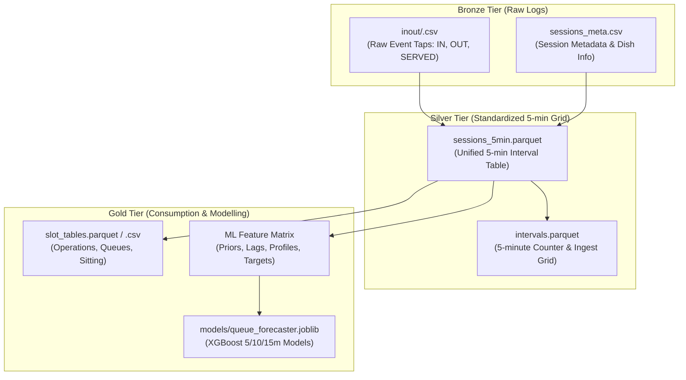

# Data Schema Specification

**Project:** Smart Mess — Queue Forecasting System (Brahmaputra Hostel Mess, IIT Guwahati)  
**Dataset Identifier:** `smartmess-brahmaputra` (`smartmess-mess-a`)  
**Dataset Version:** `1.0`  
**Storage Formats:** Apache Parquet (`data/parquet/`), CSV Samples (`data/samples/`, `data/processed/`)

---

## 1. Architectural Overview & Data Tiers

The dataset follows a tiered medallion data pipeline design:

> [!IMPORTANT]
> ### Strict Physical Sensing Boundary: Only IN, OUT, and SERVED Were Recorded
> The physical data collection infrastructure logged **ONLY three micro-events**:
> 1. `IN`: Entrance door crossing timestamp
> 2. `OUT`: Exit door crossing timestamp
> 3. `SERVED`: Main food counter departure timestamp
> 
> Plus static session metadata (`date`, `meal`, `open_time`, `close_time`, `main_dish`, `items_per_person`).
> 
> **Zero physical line-length or queue counts were recorded by observers.** Every other metric in Silver and Gold tiers—including 5-minute binned counts, queue length $Q_t$, seated hall occupancy, service rates $\mu$, and traffic intensity $\rho$—is **mathematically and physically derived** using the conservation of mass.

---

## 2. Table Catalog

| Table Name | Parquet File Path | Primary Grain | Row Count | Real Rows | Synthetic Rows | Description |
|---|---|---|---|---|---|---|
| **`sessions_meta`** | `data/parquet/sessions_meta.parquet` | Meal Session | 51 | 6 | 45 | Metadata for each breakfast, lunch, and dinner session. |
| **`inout`** | `data/parquet/inout.parquet` | Event Tap | 122,592 | 15,415 | 107,177 | Micro-level door crossings and counter food handoffs. |
| **`intervals`** | `data/parquet/intervals.parquet` | 5-Minute Window | 1,616 | 197 | 1,419 | 5-minute counter dish preparation activity. |
| **`sessions_5min`** | `data/parquet/sessions_5min.parquet` | 5-Minute Window | 1,616 | 197 | 1,419 | Unified modeling table joining door counts & service rates. |
| **`slot_tables`** | `data/parquet/slot_tables.parquet` | 5-Minute Window | 1,616 | 197 | 1,419 | Operational table with queue lengths and hall occupancy. |

---

## 3. Table Schemas & Column Dictionaries

### 3.1. `sessions_meta` (Session Metadata)
* **Grain:** 1 row per meal session (Session ID)
* **Total Rows:** 51

| Column Name | Physical Type | Logical Type | Classification | Nullable | Unit / Values | Description | Example |
|---|---|---|---|---|---|---|---|
| `session_id` | `large_string` | String (PK) | Observed | No | `<MESS>_<meal>_<YYYY-MM-DD>` | Unique meal session identifier (`SYN_` prefix for synthetic) | `MESSA_breakfast_2026-09-26` |
| `date` | `date32[day]` | Date | Observed | No | `YYYY-MM-DD` | Calendar date of the meal session | `2026-09-26` |
| `weekday` | `large_string` | String | Observed | No | `Monday` .. `Sunday` | Full day name of the week | `Saturday` |
| `meal` | `large_string` | Categorical | Observed | No | `breakfast`, `lunch`, `dinner` | Meal type | `breakfast` |
| `mess` | `large_string` | String | Observed | No | Text code | Identifier of hostel dining hall | `MESS_A` |
| `open_time` | `large_string` | Time (HH:MM) | Observed | No | 24-hr `HH:MM` | Scheduled opening time of dining hall | `08:00` |
| `close_time` | `large_string` | Time (HH:MM) | Observed | No | 24-hr `HH:MM` | Scheduled closing time of dining hall | `10:15` |
| `main_dish` | `large_string` | String | Observed | No | Menu item | Primary bottleneck main dish served | `Dosa` |
| `items_per_person`| `int64` | Integer | Observed | No | Count per plate | Standard portion units allocated per student | `2` |
| `interval_min` | `int64` | Integer | Observed | No | Minutes | Aggregation and counter counting window cadence | `5` |
| `observers` | `large_string` | String | Observed | No | Initials + role | Data collection crew on shift (real sessions) | `AB (door), CD (dish)` |
| `is_synthetic` | `int64` | Binary | Synthetic Flag | No | `0` = Real, `1` = Synthetic | Provenance indicator | `0` |
| `notes` | `large_string` | String | Observed | Yes | Free text | Operational remarks, provenance or weather notes | `real weekend session` |

---

### 3.2. `inout` (Raw Event Taps)
* **Grain:** 1 row per physical tap event
* **Total Rows:** 122,592

| Column Name | Physical Type | Logical Type | Classification | Nullable | Unit / Values | Description | Example |
|---|---|---|---|---|---|---|---|
| `session_id` | `large_string` | String (FK) | Observed | No | Foreign Key to `sessions_meta` | Meal session identifier | `MESSA_lunch_2026-09-26` |
| `ts` | `timestamp[us]` | Timestamp | Observed | No | Microsecond IST | Precise timestamp when observer tapped logger button | `2026-09-26 12:15:04.120000`|
| `event` | `large_string` | Categorical | Observed | No | `IN`, `OUT`, `SERVED` | Type of event recorded: entered, exited, or served | `IN` |
| `is_synthetic` | `int64` | Binary | Synthetic Flag | No | `0` = Real, `1` = Synthetic | Provenance indicator | `0` |

---

### 3.3. `intervals` (Counter Interval Summary)
* **Grain:** 1 row per 5-minute window per session
* **Total Rows:** 1,616

| Column Name | Physical Type | Logical Type | Classification | Nullable | Unit / Values | Description | Example |
|---|---|---|---|---|---|---|---|
| `session_id` | `large_string` | String (FK) | Observed | No | Foreign Key to `sessions_meta` | Meal session identifier | `SYN_breakfast_2026-09-07` |
| `interval_start` | `timestamp[us]` | Timestamp | Inferred | No | Timestamp IST | Left boundary of 5-min aggregation window (inclusive)| `2026-09-07 07:15:00` |
| `interval_end` | `timestamp[us]` | Timestamp | Inferred | No | Timestamp IST | Right boundary of 5-min aggregation window (exclusive)|`2026-09-07 07:20:00` |
| `items_made` | `int64` | Integer | Inferred | Yes | Units of main dish | Total units of main dish prepared/served in window | `9` |
| `is_synthetic` | `int64` | Binary | Synthetic Flag | No | `0` = Real, `1` = Synthetic | Provenance indicator | `1` |

---

### 3.4. `sessions_5min` (Core Modelling Table)
* **Grain:** 1 row per 5-minute interval per session
* **Total Rows:** 1,616

| Column Name | Physical Type | Logical Type | Classification | Nullable | Unit / Values | Description | Example |
|---|---|---|---|---|---|---|---|
| `session_id` | `large_string` | String (FK) | Observed | No | Foreign Key to `sessions_meta` | Meal session identifier | `MESSA_dinner_2026-09-26` |
| `interval_start` | `timestamp[us]` | Timestamp | Inferred | No | Timestamp IST | Start of 5-minute window | `2026-09-26 20:05:00` |
| `interval_end` | `timestamp[us]` | Timestamp | Inferred | No | Timestamp IST | End of 5-minute window | `2026-09-26 20:10:00` |
| `in_count` | `int64` | Integer | Observed/Binned| No | People | Students entering dining hall during interval | `38` |
| `out_count` | `int64` | Integer | Observed/Binned| No | People | Students leaving dining hall during interval | `12` |
| `served_count` | `int64` | Integer | Observed/Binned| No | People | Students receiving food at counter during interval | `35` |
| `items_made` | `double` | Float | Inferred | Yes | Dish items | `served_count * items_per_person` | `140.0` |
| `service_rate_items_per_min` | `double` | Float | Inferred | No | Items / minute | Rate of dish preparation (`items_made / 5.0`) | `28.0` |
| `service_rate_people_per_min`| `double` | Float | Inferred | No | People / minute | Rate of students served (`served_count / 5.0`) | `7.0` |
| `main_dish` | `large_string` | String | Observed | No | Menu item | Primary bottleneck dish | `Roti/Sabzi` |
| `items_per_person`| `double` | Float | Observed | No | Items / plate | Main dish portion count | `4.0` |
| `meal` | `large_string` | Categorical | Observed | No | `breakfast`, `lunch`, `dinner` | Meal type | `dinner` |
| `weekday` | `large_string` | String | Observed | No | Day of week | Calendar day name | `Saturday` |
| `slot_idx` | `int64` | Integer | Inferred | No | $0, 1, 2, \dots$ | Zero-indexed interval counter from session open | `1` |
| `tod_min` | `int32` | Integer | Inferred | No | Minutes ($[0, 1440)$) | Time of day represented as minutes since midnight | `1205` |
| `after_close` | `int64` | Binary | Inferred | No | `0` = Open, `1` = Closed | Indicates if window started after official close | `0` |
| `items_missing`| `int64` | Binary | Inferred | No | `0` = Present, `1` = Missing | Missing data indicator for counter log | `0` |
| `is_synthetic` | `int64` | Binary | Synthetic Flag | No | `0` = Real, `1` = Synthetic | Provenance indicator | `0` |

---

### 3.5. `slot_tables` (Operational Status & Occupancy Table)
* **Grain:** 1 row per 5-minute interval per session
* **Total Rows:** 1,616

| Column Name | Physical Type | Logical Type | Classification | Nullable | Unit / Values | Description | Example |
|---|---|---|---|---|---|---|---|
| `session_id` | `large_string` | String (FK) | Observed | No | Foreign Key to `sessions_meta` | Meal session identifier | `MESSA_lunch_2026-09-27` |
| `day` | `large_string` | String | Observed | No | Day of week | Weekday name | `Sunday` |
| `meal` | `large_string` | String | Observed | No | Meal type | Meal name | `lunch` |
| `time_slot` | `large_string` | String | Inferred | No | `HH:MM-HH:MM` | Human-readable 5-minute slot range | `12:30-12:35` |
| `people_in` | `int64` | Integer | Observed/Binned| No | People | Students entering in slot | `42` |
| `people_out` | `int64` | Integer | Observed/Binned| No | People | Students leaving in slot | `15` |
| `cumulative_in`| `int64` | Integer | Inferred | No | People | Running cumulative sum of `people_in` | `184` |
| `cumulative_out`| `int64` | Integer | Inferred | No | People | Running cumulative sum of `people_out` | `54` |
| `queue_total` | `double` | Float | Inferred (Physics)| No | People | Total students waiting across all counters: $\max(0, \text{cum\_in} - \text{cum\_served})$ | `28.0` |
| `avg_queue_per_counter` | `double` | Float | Inferred | No | People / counter | `queue_total / 3.0` (floored to 1.0 if $0 < \text{in} < 4$) | `9.3` |
| `longest_counter_queue` | `double` | Float | Inferred | Yes | People | Maximum of individual counter queues (null if aggregated) | `NaN` |
| `sitting` | `double` | Float | Inferred (Physics)| No | People | Dining hall occupancy seated at tables: $\text{cum\_in} - \text{cum\_out} - \text{queue\_total}$ | `102.0` |
| `main_dish` | `large_string` | String | Observed | No | Menu item | Primary bottleneck dish | `Rice/Dal/Roti` |
| `items_made_5min` | `double`| Float | Inferred | Yes | Units | Portions prepared in 5 minutes | `140.0` |
| `serving_rate_items_per_min`| `double`| Float | Inferred | No | Items / min | Serving rate in units per minute | `28.0` |
| `serving_rate_people_per_min`| `double`| Float | Inferred | No | People / min | Serving rate in students served per minute | `7.0` |
| `formula_estimate_per_counter`| `double`| Float| Inferred (Baseline)| No | People / counter | Naive formula baseline: $(\text{in} - \text{served})/3$ | `2.3` |
| `is_synthetic` | `int64` | Binary | Synthetic Flag | No | `0` = Real, `1` = Synthetic | Provenance indicator | `0` |

---

## 4. Machine Learning Feature Matrix Schema

Generated dynamically by `src/features.py` during training and inference pipelines. All features strictly prevent look-ahead bias (using information available up to `interval_end` of slot $t$).

| Feature Name | Type | Classification | Formula / Definition | Rationale |
|---|---|---|---|---|
| `queue_now` | Float | Inferred (Physics) | $Q_t = \max(0, Q_{t-1} + \text{in}_t - \text{served}_t)$ | Current line length stock |
| `queue_d1` | Float | Inferred | $Q_t - Q_{t-1}$ | Immediate queue momentum/growth rate |
| `in_count` | Int | Observed/Binned | Number of door IN taps in current interval | Current arrival shock |
| `in_l1` | Int | Observed/Lag | $\text{in}_{t-1}$ | 1-step lagged arrivals |
| `in_l2` | Int | Observed/Lag | $\text{in}_{t-2}$ | 2-step lagged arrivals |
| `in_r3` | Int | Inferred/Window | $\sum_{k=0}^2 \text{in}_{t-k}$ | Rolling 15-minute arrival surge |
| `out_count` | Int | Observed/Binned | Number of door OUT taps in current interval | Current hall departures |
| `out_r3` | Int | Inferred/Window | $\sum_{k=0}^2 \text{out}_{t-k}$ | Rolling 15-minute hall clearance rate |
| `served_l0` | Float | Inferred | Measured people served in slot $t$ | Current service throughput |
| `mu` | Float | Inferred (Prior+Cap)| Median service speed (people/min) when busy | Counter capacity under load |
| `dish_mu` | Float | Inferred (Prior) | Historical dish capacity prior for today's dish | Dish-specific processing rate |
| `lam` | Float | Inferred | $\text{in}_t / 5$ (people/min) | Instantaneous arrival rate $\lambda$ |
| `rho` | Float | Inferred | $(\text{in\_r3} / 15) / \mu$ | Traffic intensity ratio ($\rho > 1 \Rightarrow$ queue grows) |
| `imbalance` | Float | Inferred | $(\text{in\_r3} / 15) - \mu$ | Excess arrival velocity over service capacity |
| `occupancy` | Float | Inferred (Physics) | $\text{cum\_in} - \text{cum\_out} - Q_t$ | Students currently seated inside dining hall |
| `prof_in_1` | Float | Inferred (Prior) | Historical mean $\text{in}$ for $(\text{meal}, \text{weekday}, \text{slot}+1)$ | Expected arrivals in next 5 min |
| `prof_in_2` | Float | Inferred (Prior) | Historical mean $\text{in}$ for $(\text{meal}, \text{weekday}, \text{slot}+2)$ | Expected arrivals in next 10 min |
| `prof_in_3` | Float | Inferred (Prior) | Historical mean $\text{in}$ for $(\text{meal}, \text{weekday}, \text{slot}+3)$ | Expected arrivals in next 15 min |
| `prof_in_sum3` | Float | Inferred (Prior) | $\text{prof\_in\_1} + \text{prof\_in\_2} + \text{prof\_in\_3}$ | Cumulative expected demand over forecast horizon |
| `prof_gap` | Float | Inferred | $\text{in}_t - \text{prof\_in}(t)$ | Deviation from typical schedule (crowd anomaly) |
| `slot_idx` | Int | Inferred | Interval index $0, 1, 2, \dots$ | Position within operational window |
| `tod_min` | Int | Inferred | $\text{Hour} \times 60 + \text{Minute}$ | Absolute diurnal cycle encoding |
| `weekday_num` | Int | Inferred | $0 = \text{Mon}, \dots, 6 = \text{Sun}$ | Weekly seasonality index |
| `meal_num` | Int | Inferred | $0 = \text{Breakfast}, 1 = \text{Lunch}, 2 = \text{Dinner}$ | Meal type categorical encoding |
| `min_to_close` | Float | Inferred | Remaining operational minutes until closing | End-of-service queue liquidation pressure |
| `after_close` | Int | Inferred | Binary ($1$ if slot starts $\ge$ official closing time) | Post-closing mop-up period flag |

---

## 5. Forecasting Target Definitions

The model targets the change in queue stock ($\Delta Q$) rather than absolute queue $Q_{t+h}$, preventing drift:

$$\Delta Q_{h} = Q_{t+h} - Q_{t}, \quad h \in \{1, 2, 3\} \text{ (corresponding to 5, 10, 15 minutes)}$$

The final predicted queue length is reconstructed as:

$$\hat{Q}_{t+h} = \max\left(0, Q_t + \hat{\Delta Q}_h\right)$$
