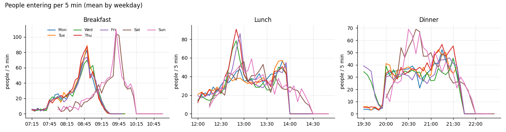
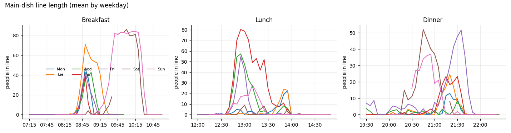
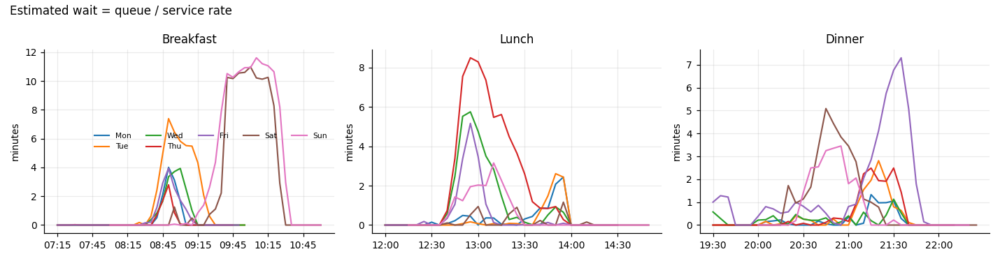
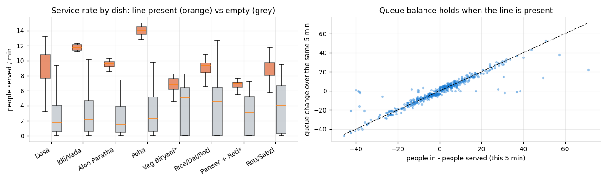
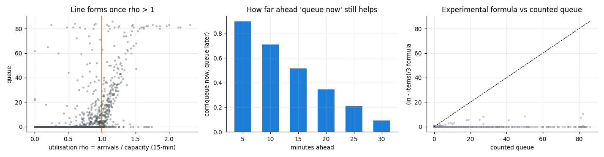
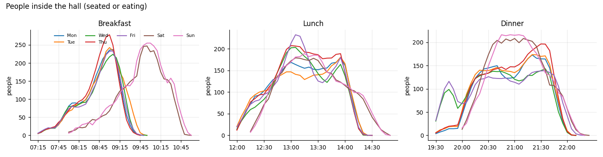

# Exploratory analysis

Data: 51 sessions, 1616 five-minute rows (real + synthetic). 

## Key findings

1. **Congestion is concentrated.** Only 16.9% of 5-minute intervals have a line of 10+ people. The worst slots are breakfast Saturday at 10:00 (mean peak 86.0); breakfast Sunday at 10:10 (mean peak 84.0); lunch Thursday at 12:55 (mean peak 80.3).
2. **The line forms when arrivals exceed service capacity.** When utilisation rho > 1, 65% of intervals are congested; when rho < 0.8, only 3% are.
3. **Queue balance holds.** In busy intervals, (people in - people served) vs the queue change over the same 5 min: correlation 0.911; mean absolute balance error 2.83 people (counting noise, plus overflow: when the line is full, new arrivals wait at tables and join later).
4. **Capacity depends on the dish.** Median people served per minute while a line is present: Dosa 8.2, Idli/Vada 11.7, Aloo Paratha 9.6, Poha 14.0, Veg Biryani (special) 6.8, Rice/Dal/Roti 9.3, Paneer + Roti (special) 7.0, Roti/Sabzi 9.0. When the line is empty, items made measures demand, not capacity, so only busy intervals are used.
5. **'Queue now' alone fades fast.** Correlation with the queue later: 5 min 0.9, 10 min 0.71, 15 min 0.52, 20 min 0.34, 25 min 0.21, 30 min 0.09. A 15-minute forecast needs arrival expectations (historical profile) and capacity, not just the current line.
6. **The experimental formula underestimates real lines.** (in - items)/3 vs counted queue: MAE 6.77 people overall and 36.24 when the line is 10+. It measures growth, not the accumulated stock, so it is kept only as a baseline.
7. **Data quality.** 3.6% of queue counts and 2.5% of item counts are missing; they are left blank, never imputed in the raw data. Largest IN-OUT door drift in a meal: 0 people.

## What this means for the model

- Target: queue length 5, 10 and 15 minutes ahead (counted, so it is a real label).
- Inputs that matter by construction: current queue, recent arrivals, service capacity for the day's dish, and the expected arrivals from the same meal and weekday in past weeks.
- Metrics must focus on congested intervals; most intervals have no line, so average error alone flatters any model.

## Peak table (mean over weeks)

| meal      | weekday   | peak_arrivals_at   |   peak_arrivals_per_5min | peak_queue_at   |   peak_queue_mean |   max_wait_mean_min |   min_per_meal_wait_over_target | main_dish               |
|:----------|:----------|:-------------------|-------------------------:|:----------------|------------------:|--------------------:|--------------------------------:|:------------------------|
| breakfast | Monday    | 08:50              |                     82.7 | 08:50           |              46.7 |                 4   |                             1.7 | Idli/Vada               |
| breakfast | Tuesday   | 08:50              |                     89   | 08:50           |              71   |                 7.4 |                            23.3 | Aloo Paratha            |
| breakfast | Wednesday | 08:50              |                     69.7 | 09:00           |              42.7 |                 3.9 |                             0   | Dosa                    |
| breakfast | Thursday  | 08:50              |                     87.7 | 08:50           |              39.3 |                 2.8 |                             0   | Poha                    |
| breakfast | Friday    | 08:50              |                     73.7 | 08:50           |              42.7 |                 3.9 |                             0   | Dosa                    |
| breakfast | Saturday  | 09:40              |                    104   | 10:00           |              86   |                11   |                            45   | Dosa                    |
| breakfast | Sunday    | 09:40              |                    110   | 10:10           |              84   |                11.6 |                            55   | Dosa                    |
| dinner    | Monday    | 21:15              |                     52.3 | 21:20           |              13   |                 1.3 |                             0   | Roti/Sabzi              |
| dinner    | Tuesday   | 21:10              |                     52.3 | 21:20           |              24.7 |                 2.8 |                             0   | Roti/Sabzi              |
| dinner    | Wednesday | 21:30              |                     45.3 | 21:30           |               8.3 |                 1.1 |                             0   | Veg Biryani (special)   |
| dinner    | Thursday  | 21:15              |                     56.7 | 21:15           |              23.3 |                 2.5 |                             0   | Roti/Sabzi              |
| dinner    | Friday    | 21:25              |                     45.7 | 21:35           |              51.7 |                 7.3 |                            16.7 | Paneer + Roti (special) |
| dinner    | Saturday  | 20:40              |                     69   | 20:45           |              52   |                 5.1 |                             5   | Roti/Sabzi              |
| dinner    | Sunday    | 20:30              |                     69   | 20:55           |              37   |                 3.5 |                             0   | Roti/Sabzi              |
| lunch     | Monday    | 13:50              |                     56.3 | 13:55           |              22.7 |                 2.4 |                             1.7 | Rice/Dal/Roti           |
| lunch     | Tuesday   | 13:50              |                     57.3 | 13:50           |              24   |                 2.6 |                             0   | Rice/Dal/Roti           |
| lunch     | Wednesday | 12:50              |                     78.3 | 12:55           |              57.3 |                 5.7 |                            13.3 | Rice/Dal/Roti           |
| lunch     | Thursday  | 12:50              |                     90.7 | 12:55           |              80.3 |                 8.5 |                            31.7 | Rice/Dal/Roti           |
| lunch     | Friday    | 12:55              |                     86   | 12:55           |              54.7 |                 5.2 |                             5   | Rice/Dal/Roti           |
| lunch     | Saturday  | 13:00              |                     56   | 13:00           |               9   |                 1.2 |                             0   | Rice/Dal/Roti           |
| lunch     | Sunday    | 13:10              |                     59   | 13:10           |              28   |                 3.2 |                             0   | Rice/Dal/Roti           |

## Figures

