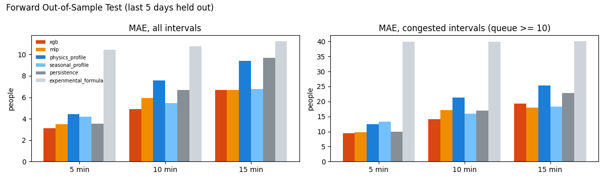
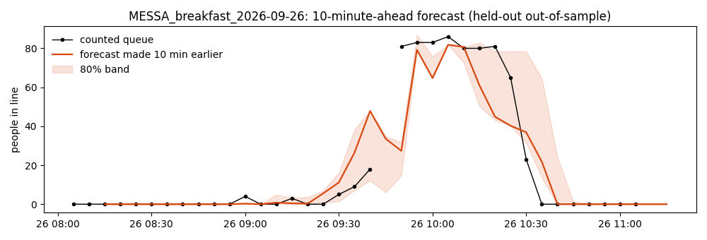
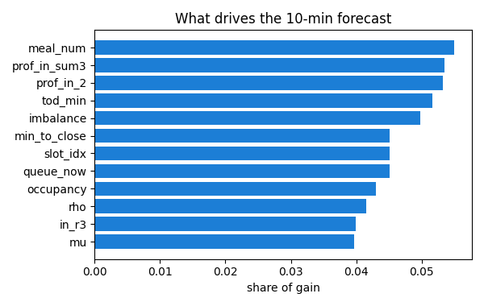

# Model results (Forward Split)

Evaluated strictly on Forward Split: trained on past dates (12 days), tested on held-out future dates (5 days, 15 sessions, including real weekend meals).

- Chosen model: **XGB** (lowest congested-interval MAE averaged over horizons on forward out-of-sample: xgb 14.28, mlp 14.98)
- XGB hyper-parameters (grouped inner CV): `{'max_depth': 5, 'n_estimators': 600, 'min_child_weight': 1}`
- Most important inputs (10-min horizon): meal_num, prof_in_sum3, prof_in_2, tod_min, imbalance

## Out-of-Sample Forward Split Metrics

### MAE (people, all intervals)

| model                |   5 min |   10 min |   15 min |
|:---------------------|--------:|---------:|---------:|
| xgb                  |    3.12 |     4.89 |     6.7  |
| mlp                  |    3.47 |     5.93 |     6.69 |
| physics_profile      |    4.43 |     7.58 |     9.43 |
| seasonal_profile     |    4.17 |     5.48 |     6.76 |
| persistence          |    3.53 |     6.69 |     9.7  |
| experimental_formula |   10.44 |    10.77 |    11.23 |

### MAE on congested intervals (true queue >= 10), people

| model                |   5 min |   10 min |   15 min |
|:---------------------|--------:|---------:|---------:|
| xgb                  |    9.4  |    14.12 |    19.32 |
| mlp                  |    9.83 |    17.16 |    17.94 |
| physics_profile      |   12.48 |    21.29 |    25.39 |
| seasonal_profile     |   13.2  |    15.99 |    18.25 |
| persistence          |    9.89 |    17.03 |    22.89 |
| experimental_formula |   39.86 |    39.85 |    40.02 |

### Wait-time MAE (minutes: predicted queue / service rate vs actual)

| model                |   5 min |   10 min |   15 min |
|:---------------------|--------:|---------:|---------:|
| xgb                  |    0.36 |     0.57 |     0.79 |
| mlp                  |    0.41 |     0.71 |     0.8  |
| physics_profile      |    0.56 |     0.98 |     1.23 |
| seasonal_profile     |    0.5  |     0.65 |     0.8  |
| persistence          |    0.4  |     0.75 |     1.08 |
| experimental_formula |    1.21 |     1.25 |     1.3  |

### RED alert (wait >= 8 min): recall, then precision (75 RED intervals across horizons in test set)

| model                |   5 min |   10 min |   15 min |
|:---------------------|--------:|---------:|---------:|
| xgb                  |    0.88 |     0.48 |     0.28 |
| mlp                  |    0.76 |     0.16 |     0.28 |
| physics_profile      |    0.48 |     0.36 |     0.48 |
| seasonal_profile     |    0.76 |     0.68 |     0.6  |
| persistence          |    0.88 |     0.72 |     0.56 |
| experimental_formula |    0    |     0    |     0    |

| model                |   5 min |   10 min |   15 min |
|:---------------------|--------:|---------:|---------:|
| xgb                  |    1    |     0.92 |     1    |
| mlp                  |    1    |     0.8  |     0.7  |
| physics_profile      |    0.92 |     0.5  |     0.5  |
| seasonal_profile     |    0.86 |     0.77 |     0.71 |
| persistence          |    0.85 |     0.69 |     0.54 |
| experimental_formula |  nan    |   nan    |   nan    |

### 80% prediction band coverage (XGB quantiles; target 0.80)

| model   |   5 min |   10 min |   15 min |
|:--------|--------:|---------:|---------:|
| xgb     |    0.69 |     0.61 |     0.66 |

## Figures

