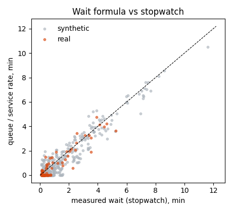

# Wait-time validation (stopwatch)

Formula: predicted wait = queue at join / service rate. Queue at join is interpolated between the 5-minute counts; service rate is the busy-interval capacity.

## Real samples

- n = 97; MAE = 0.35 min; bias = -0.18 min; within +/-2 min: 100%; correlation 0.933
- MAE when the measured wait is over 3 min: 0.63 min
- Naive guess (always the average wait) MAE: 0.86 min

## Synthetic samples

- n = 752; MAE = 0.38 min; bias = -0.25 min; within +/-2 min: 100%; correlation 0.956
- MAE when the measured wait is over 3 min: 0.55 min
- Naive guess (always the average wait) MAE: 0.89 min

